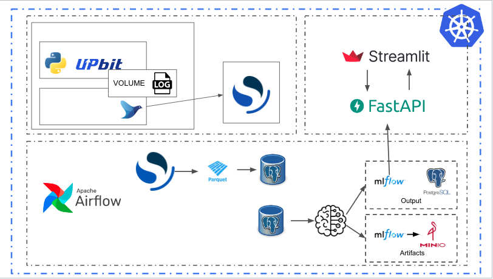

# Investment-Project

## My Project

- 머신러닝 모델을 통한 Trading Bot을 운영함으로써 일하지 않고 돈버는 삶에 도전하려 합니다.
- 1분에 100원 수익만 내보자는 생각으로 진행하고 있는 프로젝트입니다.

## Docs

- [사용 기술 소개](./docs/tech_stack.md)
- [프로젝트 시작해보기](./docs/command.md)
- [커밋 히스토리 따라잡기](./docs/commit_history.md)

## 2차 정리 (2023-05-22)

- 1차 회고 이후로 추가된 부분은 크게는 FastAPI, Streamlit 부분입니다.
- 이후로는 추가 데이터 적재, 모델학습 방법 다양화 (Spark, DeltaLake...) 등을 시도해보면 좋겠습니다.
- Hands-On 해보시면서 미흡한점 `Issue`로 남겨주시면 수정하겠습니다.

## 1차 회고 (2023-05-10)

- 현재까지 된 것은 데이터가 자동으로 쌓이고, 학습되고, 모델이 저장되는 부분까지 입니다.
- 많은 기능을 구현했다고 생각했는데 되돌아보니 많지도 않은것 같습니다.
- 이후로는 저장된 모델을 활용해 prediction 및 실제 거래 자동화 등도 시도해보려고 합니다.
    - 더 많은 데이터 적재, 학습 최적화 자동화, BI툴 연결 등등등....
- 물론 해당 작업을 하기전에 우선 Hard Coding된 부분등을 먼저 고쳐나가려 합니다.
- 프로젝트를 하면서 이런 부분은 신경써도 되는것 아니야? 라고 이슈로 남겨 지적해주시면 감사하겠습니다.

