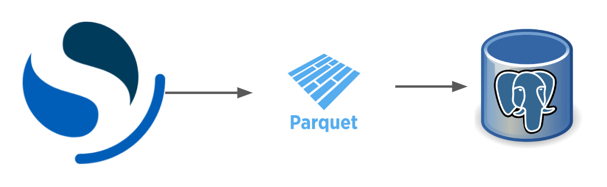

# Investment-Project

## 2023-05-08

- ML, DL 등 모델 활용을 위해 airflow image에 torch와 sklearn을 추가해두었습니다. (미정)
- Model 학습 후 Model Registry 를 위해 MLflow 추가하였습니다.
    - Model File은 Minio와 연동하여 사용 (Minio가 쓸 directory를 ansible로 작업 예정)

## 2023-05-07

- Airflow 간단한 Data Pipeline 관련 Dag을 작성하였습니다.
- 1. OpenSearch에서 2시간전~1시간전 까지 데이터를 읽어 Parquet 형식으로 데이터를 저장합니다.
- 2. 읽은 Datatime범위에 대해 postgresql에서 테이블의 데이터를 삭제합니다.
- 3. Postgresql에 Insert 합니다.

## 2023-05-01 ~ 2023-05-03

- Airflow task간 데이터를 주고받을 volume을 추가하였는데 해당 내용을 위한 ansible-playbook yaml내용을 추가하였습니다.
- Airflow Sample dag을 작성하였습니다. (Hard Code)

## 2023-04-26

- Airflow task간 데이터를 주고받을 volume을 추가하였습니다.

## 2023-04-24

- Airflow logs directory가 volume mount되지 않으니 webserver에서 log확인이 되지않아 volume 및 nfs 추가하였습니다.

## 2023-04-18

- Kubernetes에 Airflow Webserver와 Scheduler를 배포했습니다.
    - dags 폴더 mount는 nfs서버를 추가하여 PersistentVolume으로 사용가능하도록 작업했습니다.
- Airflow 는 현재 SequentialExecutor로 사용되고 있습니다.
    - 추후 config 파일을 수정해 celery executor 혹은 kubernetes executor 를 사용하려 합니다.

## 2023-04-02

- postgresql 을 배포하는 yaml파일이 생성되었습니다.
- 이는 DW, airflow db 로 사용될 예정입니다. (분리하는것이 맞는것으로 보이지만 프로젝트 편의를 위해 통합)

## 2023-03-26

- datetime field가 올바르게 적용되지 않고 있음을 확인하여 `ticker/main.py` 코드 변경이 있었습니다.
- 폴더구조가 직관적이지 않아 각각으로 분리하였습니다.
- start & terminate command를 추가하였습니다.

## 2023-03-22

- OpenSearch-DashBoard를 통해 OpenSearch에 적제된 데이터를 시각화 한 모습입니다.
- 적제된 KRW-BTC & KRW-ETH 데이터에 대해 Change값에서 RISE, FALL, EVEN 이 차지하는 비율을 PIE차트로 나타내었습니다.

## 2023-03-20

- 로깅을 간소화 했고 imagePullPolicy를 추가해 매번 이미지를 새로 당겨오도록 수정하였습니다.

## 2023-03-15

- 하나의 POD에 하나의 Container안에서 모든 작업을 다 진행하는 구조에서 하나의 Pod에서 두개의 Container로 나누었습니다.
- python으로 logging을 하는 container & fluentd로 log를 전송하는 container

## 2023-03-04

- Kubernetes버전을 올리고 기존 calico를 사용하면서 init Pod Network을 `10.244.0.0/16` 으로 flannel을 사용할때 처럼 적어놔서 수정했습니다.
- 기존 ticker logging -> opensearch 형태를 kubernetes에 배포가능한 형태로 만들기 위한 작업을 하였습니다.

## 2023-03-03

- Ansible로 구성한 kubernetes환경이 잘못되었는지 Pod Container에서 outbound에 문제가 있어 수정해야할 필요가 있을것으로 보입니다.
- 도커 Base Image를 수정하였습니다.

## 2023-03-02

- 데이터 소스로 pyupbit를 사용하였습니다.
- fluentd를 사용하여 opensearch로 데이터를 쏘는 로직입니다.
- 후에 kubernetes에 opensearch & dashboard를 배포하여 적재를 확인할 예정입니다.
## 2023-02-23

- Terraform & Ansible 조합으로 사용하는 인프라 환경을 매번 클릭하지않고 구축하고자 진행하였습니다.
- GCP Compute engine `e2-highcpu-4` 3대를 사용하여 kubernetes환경을 구축하였습니다.
- 빈틈이 많겠지만 서서히 채워나가는것이 목표