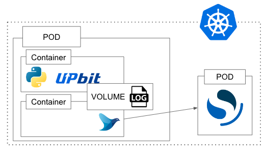

# Investment-Project

## 2023-03-20

- 로깅을 간소화 했고 imagePullPolicy를 추가해 매번 이미지를 새로 당겨오도록 수정하였습니다.

## 2023-03-15

- 하나의 POD에 하나의 Container안에서 모든 작업을 다 진행하는 구조에서 하나의 Pod에서 두개의 Container로 나누었습니다.
- python으로 logging을 하는 container & fluentd로 log를 전송하는 container

## 2023-03-04

- Kubernetes버전을 올리고 기존 calico를 사용하면서 init Pod Network을 `10.244.0.0/16` 으로 flannel을 사용할때 처럼 적어놔서 수정했습니다.
- 기존 ticker logging -> opensearch 형태를 kubernetes에 배포가능한 형태로 만들기 위한 작업을 하였습니다.

## 2023-03-03

- Ansible로 구성한 kubernetes환경이 잘못되었는지 Pod Container에서 outbound에 문제가 있어 수정해야할 필요가 있을것으로 보입니다.
- 도커 Base Image를 수정하였습니다.

## 2023-03-02

- 데이터 소스로 pyupbit를 사용하였습니다.
- fluentd를 사용하여 opensearch로 데이터를 쏘는 로직입니다.
- 후에 kubernetes에 opensearch & dashboard를 배포하여 적재를 확인할 예정입니다.
## 2023-02-23

- Terraform & Ansible 조합으로 사용하는 인프라 환경을 매번 클릭하지않고 구축하고자 진행하였습니다.
- GCP Compute engine `e2-highcpu-4` 3대를 사용하여 kubernetes환경을 구축하였습니다.
- 빈틈이 많겠지만 서서히 채워나가는것이 목표