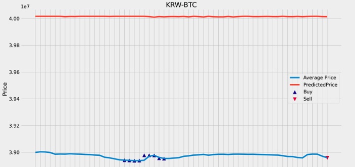
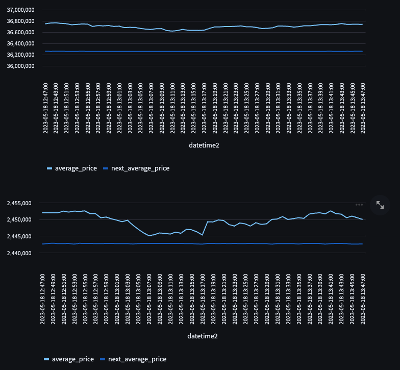
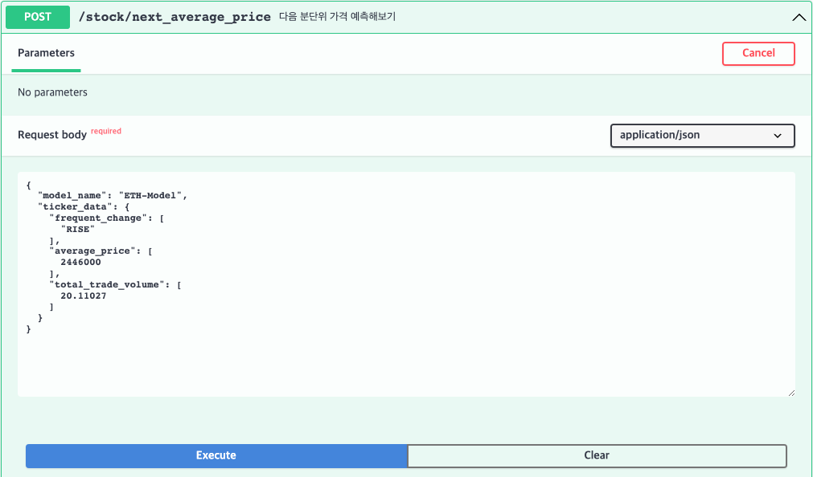
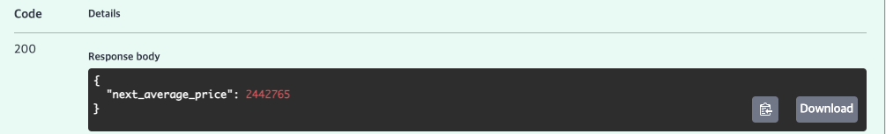
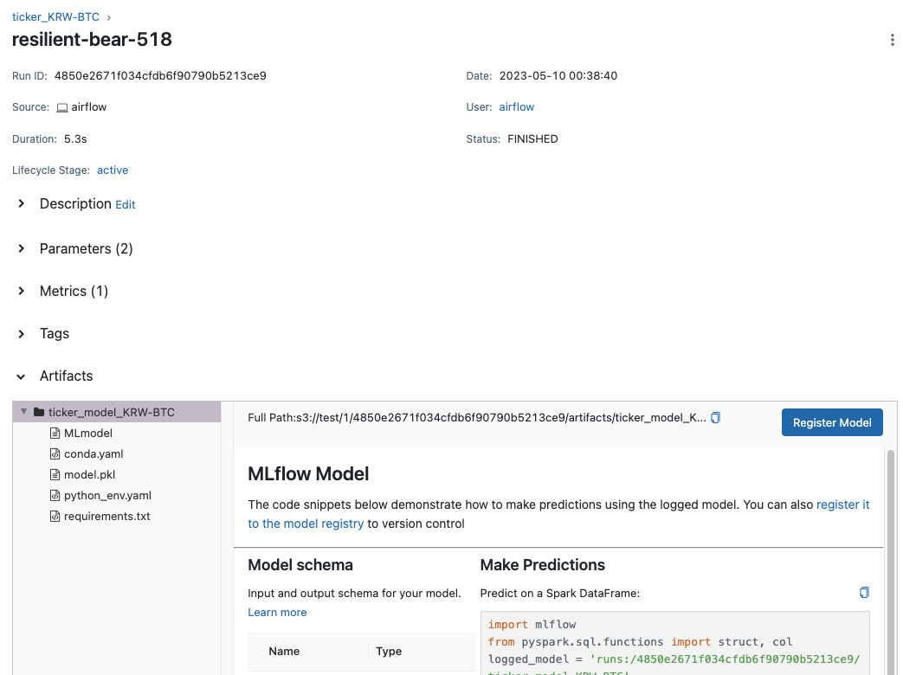
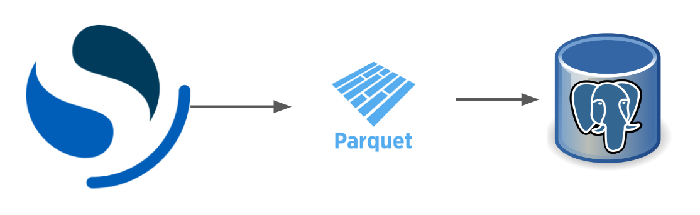

# Commit History

## 2023-07-16



- Streamlit에 Back Testing 현황을 보려고 Buy, Sell 표시를 추가하였습니다.
- 모델성능의 문제로 예측가격이 너무 높게 찍혀서 유의미한 결과가 나오지 않는것 같습니다.
- 모델 학습 및 저장 로직을 한차례 변경한 후에 다시 시도해보겠습니다.

## 2023-07-09

- 이전: 수동으로 MLFlow 에서 Production Model을 등록하여야 합니다.
- 현재: Evaluation Metric과 Optimize_method에 따라 Production Model을 업데이트 합니다.
- 여담으로 이제 대망의 등록된 Production Model을 활용하여 trading bot을 운용하는 부분만 남은것 같습니다.

## 2023-07-05

- Airflow Dag과 실제 로직을 분리하였습니다.
- 분리하며 재활용 가능성도 같이 높이면 좋겠지만 우선 Controller와 Service를 분리하는 느낌으로 분리작성하였습니다.

## 2023-06-28

- Airflow Task 코드를 깔끔하게 작성하기 위해 반복되는 코드를 줄이려 OpenSearch 조회 관련 Class를 작성하였습니다.

## 2023-05-29

- Metric에 BackTesting한 결과를 추가하였습니다.
    - (Prediction 결과보다 저렴하다) & (최근 구매보다 1분이상 지났다.) -> 시장가 매수
    - (구매한것 중에 현재 가격이 구매당시 가격보다 0.2퍼센트 이상 상승한 경우) -> 시장가 매도
    - 1시간동안 매도 되지 않은것이 남아있다면 전량 시장가로 매도
- MAE 계산에서 prediction 결과와 다음 avg_totalprice 이어야 계산이 맞기때문에 계산방법을 수정하였습니다.

## 2023-05-24

- Airflow 환경변수 부분을 수정하였습니다.
- README에 포함된 내용이 많아짐에 따라 분리하였습니다.

## 2023-05-21

- k8s배포 mlflow.yaml 에서 환경변수를 잘못쓰고 있던것을 수정했습니다.
- ansible playbook 에서 github clone시에 owner를 수정했습니다. + minio bucket directory를 미리 생성해두었습니다.
- airflow data pipeline에 delete task 부분이 조금 수정되었습니다.
- start.sh & terminate.sh 수정이 있었습니다. (start.sh의 sleep은 image pulling을 한번에 하니 지나치게 시간이 오래걸려 추가하였습니다.)

<hr>

## 2023-05-20

- K8s 배포 yaml에 secret을 사용하도록 수정하였습니다.
- minio nfs같은 경우 ansible-playbook에 누락되어있어서 수정하였습니다.

<hr>

## 2023-05-18



- FastAPI Response Schema가 return 형태가 단일 float 에서 변경해서 list로 리턴하도록 하였습니다.
- 간단한 Streamlit 코드를 작성하여 모델 시각화를 진행합니다.
    - Production Model 자체가 등록된지 오래되다 보니 제대로 예측을 수행하지 못하는듯한 모습을 보입니다.
    - 더 다양한 Model을 Load하여 잘 예측할 수 있는 시나리오를 작성할 필요를 느낍니다.
    - EX - Voting / Best Score Model Use ...

<hr>

## 2023-05-14

<div style="display:flex; width:100%">
    
    
</div>

- Model Serving을 위한 FastAPI를 추가하였습니다.
- 현재는 Production Model 을 Load 해서 예측합니다.
- Production Model을 제일 좋은 성능을 가진 모델로 등록하는 방법도 존재하므로 Airflow쪽 코드에 추가할 가능성이 있습니다.
- 모든 모델을 다 Load해서 Prediction을 진행해서 Voting하는 방법도 존재하므로 FastAPI쪽에 코드를 추가할 가능성이 있습니다.
- (Airflow train Dag이 수정되었습니다. - 1분간격으로 Aggregation을 하여 train data 생성)

<hr>

## 2023-05-10

- tf 파일들의 재사용성을 높이려 하였습니다.
- terraform/terraform.tfvars 파일을 생성하여 아래 3개의 값을 설정합니다.
```
iam_user_name="my_google_user"
my_project_id="my_project_id-320492"
my_ssh_key="my_ssh_key_filename"
```
- static folder 아래에 my_project_id에 등록한 파일명을 가진 google credential 파일을 위치시킵니다.
- static folder 아래에 내 ssh key를 생성하여 위치시킵니다.

<hr>

## 2023-05-10



- 간단한 학습 파이프라인 Dag을 추가하였습니다.
- 학습을 하게되면 스크린샷과 같이 Parameters, Metric 이 저장되고 Model은 Minio에 저장됩니다.
- 조금 시간을 잡아먹었던것은 Client Side에서 MLFLOW_S3_ENDPOINT_URL가 없으니까 이상한곳으로 save를 시도하는지 Authentication 관련 에러가 나서 디버깅에 시간을 썼습니다.

<hr>

## 2023-05-08

- ML, DL 등 모델 활용을 위해 airflow image에 torch와 sklearn을 추가해두었습니다. (미정)
- Model 학습 후 Model Registry 를 위해 MLflow 추가하였습니다.
    - Model File은 Minio와 연동하여 사용 (Minio가 쓸 directory를 ansible로 작업 예정)


<hr>

## 2023-05-07



- Airflow 간단한 Data Pipeline 관련 Dag을 작성하였습니다.
- 1. OpenSearch에서 2시간전~1시간전 까지 데이터를 읽어 Parquet 형식으로 데이터를 저장합니다.
- 2. 읽은 Datatime범위에 대해 postgresql에서 테이블의 데이터를 삭제합니다.
- 3. Postgresql에 Insert 합니다.

<hr>

## 2023-05-01 ~ 2023-05-03

- Airflow task간 데이터를 주고받을 volume을 추가하였는데 해당 내용을 위한 ansible-playbook yaml내용을 추가하였습니다.
- Airflow Sample dag을 작성하였습니다. (Hard Code)

<hr>

## 2023-04-26

- Airflow task간 데이터를 주고받을 volume을 추가하였습니다.

<hr>

## 2023-04-24

- Airflow logs directory가 volume mount되지 않으니 webserver에서 log확인이 되지않아 volume 및 nfs 추가하였습니다.

<hr>

## 2023-04-18


- Kubernetes에 Airflow Webserver와 Scheduler를 배포했습니다.
    - dags 폴더 mount는 nfs서버를 추가하여 PersistentVolume으로 사용가능하도록 작업했습니다.
- Airflow 는 현재 SequentialExecutor로 사용되고 있습니다.
    - 추후 config 파일을 수정해 celery executor 혹은 kubernetes executor 를 사용하려 합니다.


<hr>

## 2023-04-02

- postgresql 을 배포하는 yaml파일이 생성되었습니다.
- 이는 DW, airflow db 로 사용될 예정입니다. (분리하는것이 맞는것으로 보이지만 프로젝트 편의를 위해 통합)

<hr>

## 2023-03-26

- datetime field가 올바르게 적용되지 않고 있음을 확인하여 `ticker/main.py` 코드 변경이 있었습니다.
- 폴더구조가 직관적이지 않아 각각으로 분리하였습니다.
- start & terminate command를 추가하였습니다.

<hr>

## 2023-03-22


- OpenSearch-DashBoard를 통해 OpenSearch에 적제된 데이터를 시각화 한 모습입니다.
- 적제된 KRW-BTC & KRW-ETH 데이터에 대해 Change값에서 RISE, FALL, EVEN 이 차지하는 비율을 PIE차트로 나타내었습니다.

<hr>

## 2023-03-20

- 로깅을 간소화 했고 imagePullPolicy를 추가해 매번 이미지를 새로 당겨오도록 수정하였습니다.

<hr>

## 2023-03-15


- 하나의 POD에 하나의 Container안에서 모든 작업을 다 진행하는 구조에서 하나의 Pod에서 두개의 Container로 나누었습니다.
- python으로 logging을 하는 container & fluentd로 log를 전송하는 container


<hr>

## 2023-03-04


- Kubernetes버전을 올리고 기존 calico를 사용하면서 init Pod Network을 `10.244.0.0/16` 으로 flannel을 사용할때 처럼 적어놔서 수정했습니다.
- 기존 ticker logging -> opensearch 형태를 kubernetes에 배포가능한 형태로 만들기 위한 작업을 하였습니다.

<hr>

## 2023-03-03

- Ansible로 구성한 kubernetes환경이 잘못되었는지 Pod Container에서 outbound에 문제가 있어 수정해야할 필요가 있을것으로 보입니다.
- 도커 Base Image를 수정하였습니다.

<hr>

## 2023-03-02

- 데이터 소스로 pyupbit를 사용하였습니다.
- fluentd를 사용하여 opensearch로 데이터를 쏘는 로직입니다.

-<hr>
 후에 kubernetes에 opensearch & dashboard를 배포하여 적재를 확인할 예정입니다.
## 2023-02-23

- Terraform & Ansible 조합으로 사용하는 인프라 환경을 매번 클릭하지않고 구축하고자 진행하였습니다.
- GCP Compute engine `e2-highcpu-4` 3대를 사용하여 kubernetes환경을 구축하였습니다.
- 빈틈이 많겠지만 서서히 채워나가는것이 목표
